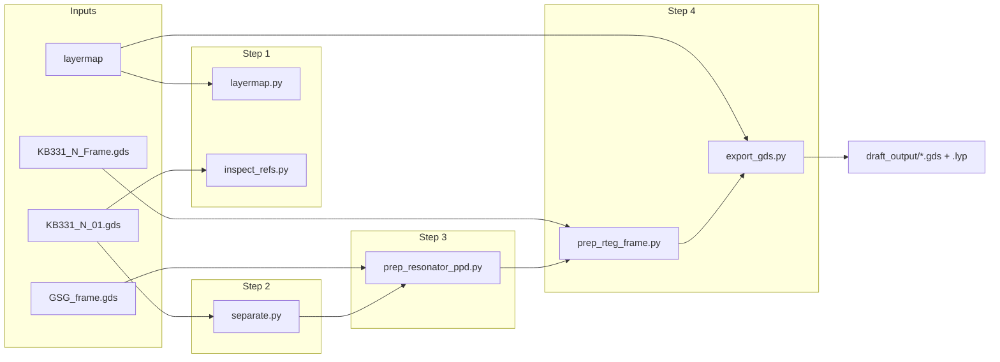

# R-tag automation — Python pipeline

Automates **R-tag (RTEG) test layouts** for BAW filters at Skyworks: take a clean filter GDS and produce per-resonator test structures inside a GSG probe frame. The manual flow today runs in **Cadence Virtuoso** via Jing Yang's SKILL script [`rdsBawTEGAutoFromTemp.il`](rdsBawTEGAutoFromTemp.il). This repo rebuilds that flow in Python.

For scope, constraints, and domain context see [`CLAUDE.md`](CLAUDE.md).

---

## Status

| Step | Notebook section | Status |
|---|---|---|
| 1. Process inputs | Layermap + GDS sanity checks | Done |
| 2. Selection | Identify resonators and vias | Done |
| 3. Separation | Center resonator in GSG PPD frame | Done |
| 4. Setting up | Place assembly in die frame + export GDS | Done |
| 5. Routing | MBE/MTE interconnect | Planned |
| 6. Verification | DRC-clean layout | Planned |

Steps 1–4 run end-to-end in [`python_code/single_run.ipynb`](python_code/single_run.ipynb).

---

## Setup

```powershell
cd python_code
pip install gdstk pandas
```

Open `single_run.ipynb` and run all cells top-to-bottom. The notebook resolves paths from `python_code/` (needs `input_files/` and `src/`).

---

## How to run

**Primary entry point:** `python_code/single_run.ipynb`

Optional CLI checks (from `python_code/`, with `src/` on `PYTHONPATH` or run via notebook path setup):

```powershell
python src/separate.py input_files/KB331_N_01.gds
python src/inspect_refs.py input_files/KB331_N_01.gds input_files/KB331_N_Frame.gds
```

---

## Pipeline (matches the notebook)



### Step 1 — Process inputs

Load the Skyworks layermap and confirm GDS hierarchy looks correct.

| Module | Role |
|---|---|
| `src/layermap.py` | Parse `input_files/layermap` → name ↔ `(layer, datatype)` |
| `src/inspect_refs.py` | List references and labels in filter, frame, and PPD GDS |

### Step 2 — Selection

Find resonators and vias under the filter parent cell.

| Module | Role |
|---|---|
| `src/separate.py` | `identify(filter_gds)` → `res_df`, `res_list`, `via_df` |

Identification rules match the SKILL script: masters starting with `series`, `shunt`, `rcap`, `mimcap`; vias with `vtb`.

### Step 3 — Separation

For each resonator, build an in-memory **PPD + centered resonator** assembly.

| Module | Role |
|---|---|
| `src/prep_resonator_ppd.py` | `prep_resonator_ppd(res_df, res_list, ppd_gds)` → `ppd_assemblies` |
| `src/rteg_utils.py` | Shared bbox / top-cell helpers |

Centering uses bbox alignment only (no scale). A 10 µm axis-aligned nudge keeps resonator MBE/MTE clear of GSG pad metal.

### Step 4 — Setting up

Place each PPD assembly in the die frame and export GDS.

| Module | Role |
|---|---|
| `src/prep_rteg_frame.py` | `prep_rteg_in_frame(ppd_assemblies, frame_gds)` → `rteg_assemblies` |
| `src/export_gds.py` | `export_gds(..., layermap=layermap)` → one GDS + `.lyp` per resonator |

Placement rules (inner MBE ring cavity, not the outer 460×580 bbox):

- **X:** left-aligned at 4% margin inside the inner frame
- **Y:** assembly bbox centered at 7% margin band
- **MBE filler:** rectangle from inner-frame center to the margined right edge, height = placed assembly bbox

Export writes only the reachable cell hierarchy (single top cell) and filters layers to the layermap. Open each `.gds` in KLayout with its matching `.lyp` for Skyworks layer names.

### Steps 5–6 — Routing and DRC (not implemented)

Interconnect routing, ground recut, via placement, and sign-off DRC will build on the in-memory assemblies from step 4.

---

## Inputs (`python_code/input_files/`)

| File | Role |
|---|---|
| `KB331_N_01.gds` | Clean hierarchical filter layout |
| `KB331_N_Frame.gds` | Die frame template (460×580 µm outer bbox) |
| `GSG_frame.gds` | GSG PPD / probe-pad reference |
| `layermap` | Skyworks layer-name table |

---

## Outputs (`python_code/draft_output/`)

After the export cell in the notebook:

- `{parent}_RTEG1_{index:02d}_{inst_name}_framed.gds` — one file per resonator (index disambiguates shared master names)
- Matching `.lyp` — KLayout layer properties from the layermap

---

## Source layout (`python_code/src/`)

| File | Step |
|---|---|
| `layermap.py` | 1 |
| `inspect_refs.py` | 1 |
| `separate.py` | 2 |
| `prep_resonator_ppd.py` | 3 |
| `prep_rteg_frame.py` | 4 |
| `export_gds.py` | 4 (export) |
| `rteg_utils.py` | shared geometry helpers |

---

## Concepts

| Term | Meaning |
|---|---|
| **R-tag / RTEG** | Per-resonator test layout in a GSG frame |
| **PPD** | Probe-pad device (`GSG_frame.gds`) |
| **Preserved metal** | Filter interconnect kept exact near the resonator (step 5+) |
| **Layermap** | Maps `BAW_MBE`, `BAW_MTE`, … to GDS layer/datatype pairs |

---

## Reference layouts

Golden/manual layouts live outside this pipeline (e.g. Virtuoso exports under `KB331_files/`). They are reference only — step 4 output is generated in-memory and written to `draft_output/` when you run export.
