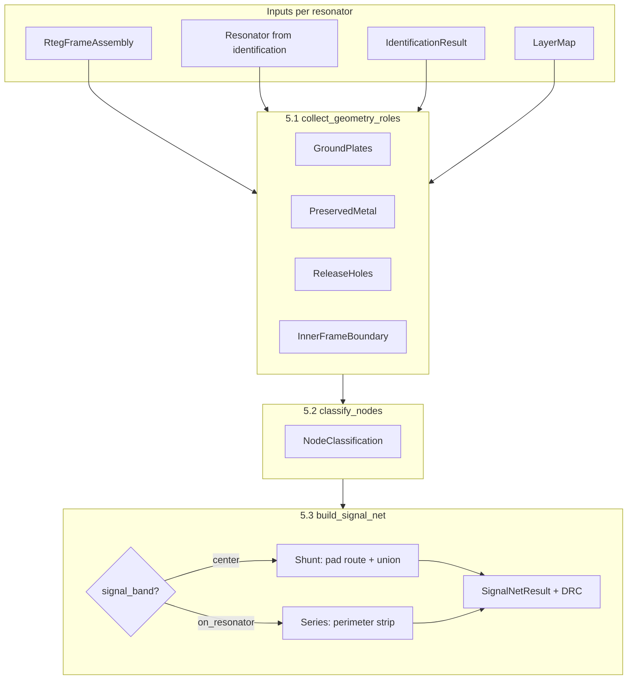
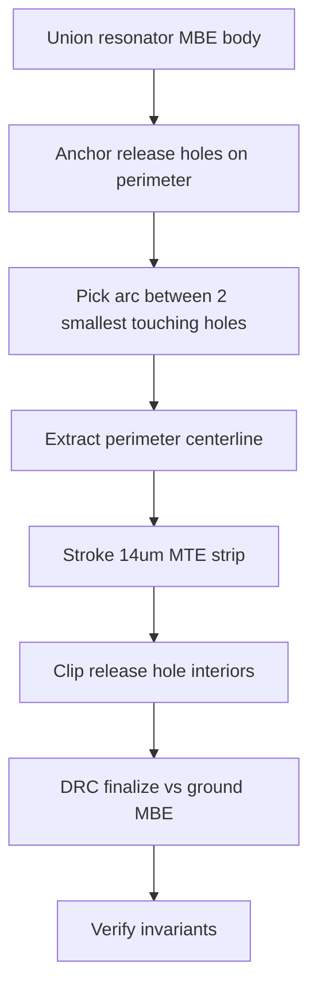

# Step 5 — From RTEG frame to signal MTE

This document explains how the notebook (`single_run.ipynb`) goes from a **step-4 framed RTEG assembly** to a **generated signal MTE net** (step 5.3). It covers inputs, coordinate frames, each sub-step, shunt vs series behavior, and the geometry treatments applied today.

**Modules:** `rteg_collect.py` (5.1) · `rteg_classify.py` (5.2) · `rteg_signal.py` (5.3) · `rteg_series_mte.py` (series strip geometry)

---

## What step 5 produces

For each resonator index, step 5 answers:

1. **What metal is ground vs signal?** (5.2)
2. **Where is the MTE signal path?** (5.3)
3. **Is it DRC-clean vs ground MBE?** (14 µm minimum spacing in `SignalBuildConfig`)

Output is a `SignalNetResult` per resonator: MTE polygons, connector metadata, and DRC flags. That can be exported on top of the framed layout as `*_mte.gds` via `export_signal_rteg_gds`.

---

## Prerequisites (steps 1–4)

Step 5 does **not** read the raw filter GDS directly. It consumes objects built earlier in the pipeline:

| Step | Module | What step 5 needs from it |
|------|--------|---------------------------|
| 1–2 | `separate.py` | `IdentificationResult` — resonator list with `origin`, `rotation`, `x_reflection`, `res_type` (shunt/series) |
| 3 | `prep_resonator_ppd.py` | `ResonatorPpdAssembly` — GSG template + centered resonator in PPD space |
| 4 | `prep_rteg_frame.py` | `RtegFrameAssembly` — PPD assembly placed in die frame + MBE filler plate |
| — | `layermap` | Layer name → GDS layer/datatype (`BAW_MBE`, `BAW_MTE`, `BAW_ReF`, `BAW_CAV`, …) |

### `RtegFrameAssembly` (one per resonator)

Built by `prep_rteg_in_frame`. Each assembly contains:

- **Die frame** reference at `frame_origin`
- **PPD + resonator** reference at `assembly_origin` (left-aligned X, centered Y inside margined inner cavity)
- **MBE filler** — a large ground rectangle on the **right** side of the content box (normalizes RTEG width)
- Metadata: `inner_die_frame_bbox`, `mbe_filler_bbox`, `ppd_assembly.resonator_origin`, etc.

Flattening the assembly (`assembly.flatten()`) yields all polygons in **RTEG world coordinates** — the coordinate system used for pads, filler, frame, and (via references) the placed resonator.

---

## Coordinate frames (why instances can look “wrong”)

Three frames appear in the pipeline. Mixing them up is the usual source of confusion.

### 1. Filter coordinates

- Origin: parent filter variant cell.
- Each resonator instance has `res.origin`, `res.rotation`, `res.x_reflection` from step 2.
- **Connect cells** (`{parent}_connectMBE`, `{parent}_connectMTE`) live here — fixed filter-level interconnect polygons.

### 2. PPD / step-3 coordinates

- GSG probe template placed at `ppd_origin`.
- Resonator reference moved so its bbox centers on the template (plus clearance nudges).
- `ppd_assembly.resonator_origin` = filter origin + centering/clearance shift.
- Rotation and reflection are **unchanged** from the filter instance.

### 3. RTEG world coordinates

- Everything in the framed layout after step 4.
- Resonator world origin:

  ```
  rteg_origin = assembly_origin + ppd_assembly.resonator_origin
  ```

- **`_resonator_shift`** (in `rteg_collect.py`) is the delta from filter placement to RTEG placement:

  ```
  shift = rteg_origin - res.origin
  ```

### How different geometry types are transformed

| Geometry | Transform into RTEG world |
|----------|---------------------------|
| **Resonator body (MBE/MTE)** | `resonator_metal_polys(res, shift)` — full `gdstk.Reference` (translate + **rotate** + mirror) |
| **Release holes (ReF/CAV)** | `resonator_release_hole_polys(res, shift)` — same reference transform as body |
| **Preserved connect MBE/MTE** | `_filter_to_rteg_world` — **translate only** by `shift` (connect polygons stay in filter orientation) |
| **GSG pads** | From flattened PPD cell, already in RTEG world |
| **MBE filler** | From flattened frame assembly, RTEG world |

**Important:** Preserved filter MTE is **not** rotated with the resonator instance. It is filter-routing metal selected by overlap with an axis-aligned filter bbox, then shifted into RTEG space. For series resonators, preserved MTE may sit far from the generated perimeter strip — that is expected today. **Series signal MTE is not built from preserved connect MTE.**

For resonator body and release holes, use `resonator_placement_summary(res, assembly)` in `rteg_collect.py` to debug placement.

---

## Pipeline overview



---

## Step 5.1 — Collect geometry roles

**Function:** `collect_geometry_roles(assembly, res, identification, layermap)`

Splits the framed layout into labeled polygon groups (`TaggedPolygon`: `label`, `layer_name`, `polygon`).

### Ground plates (`collect_ground_plates`)

- **Source:** MBE polygons from the GSG PPD template (pad keepouts), in RTEG world.
- **Excludes** polygons whose bbox overlaps the resonator MBE bbox (resonator metal is not a pad).
- **Clusters** remaining pads by Y-centroid into `top`, `center`, `bottom`.
- **Filler:** MBE polygon matching `assembly.mbe_filler_bbox` (the step-4 width filler).

Net assignment (signal vs ground) is **not** done here — only spatial grouping.

### Preserved metal (`collect_preserved_metal`)

- **Source:** `{parent}_connectMBE` and `{parent}_connectMTE` cells from the filter library.
- **Selection:** Polygons whose bbox overlaps `resonator_world_bbox(res)` expanded by 10 µm (axis-aligned filter bbox — no rotation).
- **Placement:** Translated into RTEG by `_filter_to_rteg_world` (shift only).

Used heavily for **shunt** routing (launch point from preserved MTE). For **series**, preserved MTE is collected but the signal net is built separately on the resonator perimeter.

### Release holes (`collect_release_holes`)

- **Source:** `resonator_release_hole_polys(res, shift)` — holes from the resonator **master cell** with the same reference transform as resonator MBE.
- Layers: `BAW_ReF`, `BAW_CAV` (via layermap).
- Does **not** scrape arbitrary holes from the full flattened assembly (avoids frame-scale false positives).

### Frame boundary (`get_inner_frame_boundary`)

- Inner die cavity rectangle from `inner_die_frame_bbox`.
- Optional frame MBE ring polygon from the frame master cell.

**Output type:** `RtegGeometryRoles` — one struct per resonator index.

---

## Step 5.2 — Classify GSG nodes

**Function:** `classify_nodes(ground_plates, preserved, res_type=...)`

Classification is **rule-based from resonator type only** (no MTE adjacency heuristics).

| `res_type` | Center pad | Top / bottom pads | `signal_band` |
|------------|------------|-------------------|---------------|
| **shunt** | signal | ground | `center` |
| **series** | ground | ground | `on_resonator` |

- `filler_plate` is always **ground** (not a GSG probe node).
- `preserved` is accepted for API symmetry but **not used** in classification.

**Output type:** `NodeClassification` — drives which pad (if any) step 5.3 routes to.

---

## Step 5.3 — Build signal MTE net

**Function:** `build_signal_net(preserved, classification, ground_plates, layermap, config, *, res, assembly, release_holes)`

**Config (`SignalBuildConfig` defaults):**

| Parameter | Default | Meaning |
|-----------|---------|---------|
| `mbe_mte_spacing_um` | 14.0 | DRC: minimum MTE-to-ground-MBE spacing |
| `plate_width_um` | 14.0 | Connector / series strip width |
| `connect_tolerance_um` | 0.5 | “Touching” tolerance for pad merge checks |
| `boolean_precision` | 1e-3 | gdstk boolean precision (µm) |

**Ground obstacles for DRC:** all MBE polygons tagged `ground` in classification (GSG ground pads + filler).

---

### Shunt path (`signal_band == "center"`)


1. **`signal_endpoints`** — Finds the preserved MTE polygon closest to the center signal pad; computes facing launch points on metal and pad edges.
2. **`build_signal_plate`** — Tries orthogonal routes (straight, L, 45°, Z-jog). Picks shortest path that clears ground MBE by 14 µm when possible. Strokes centerline with `plate_width_um` (FlexPath).
3. **`union_signal_net`** — Boolean-OR preserved MTE polygons + connector into one MTE net.
4. **Verify** — Connector must merge with preserved MTE, reach signal pad within `connect_tolerance_um`, and respect 14 µm ground spacing.

**Success criteria:** `is_connected` + `reaches_pad` + no DRC violations.

---

### Series path (`signal_band == "on_resonator"`)

Series resonators have **no GSG signal pad**. Signal MTE is a thin band on the resonator body between two release holes.

**Requires extra kwargs:** `res`, `assembly`, `release_holes` (from 5.1).

**Function:** `build_series_boundary_mte` in `rteg_series_mte.py`



#### A. Resonator body

- Boolean-OR of resonator **MBE** polygons (`resonator_metal_polys`, layer 2) in RTEG world.
- This outline is the perimeter the strip follows — **not** preserved connect MTE.

#### B. Release-hole anchors

- For each hole: if `body AND hole` is non-empty, contact = centroid of intersection.
- Map contact to arc-length `s` along the body perimeter (ordered vertices, cumulative edge length).

#### C. Signal arc selection

- Among holes that **touch** the body, take the **two smallest by area** (KB331: ~520–547 µm² pair).
- Two gaps exist between them around the perimeter; choose the **shorter** gap.
- Extract polyline along perimeter from `s_start` → `s_end`.

#### D. Stroke and hole clip

- Stroke centerline with `plate_width_um` (14 µm) on `BAW_MTE`.
- **Clip hole interiors:** `strip NOT holes`, then tiny inward shrink (0.05 µm) to avoid boolean slivers.

#### E. DRC finalize (`_finalize_series_strip_drc`)

The stroke is **centered** on the perimeter, so ~7 µm extends outward from the body edge. On instances where that outward side faces the step-4 **MBE filler** (right side of layout, x ≈ 230+ µm), the raw strip can collide with ground at 0 µm spacing even though the resonator transform is correct.

Treatment:

1. Try inward centerline offsets: 0, 3.5, 5, 7 µm (toward resonator interior).
2. For each: stroke → trim against **grown** ground keepouts (`ground MBE offset by 14 µm`, then `strip NOT grown`) → re-clip holes.
3. Discard candidates that overlap release holes or have near-zero area.
4. Prefer candidates with ≥ 14 µm ground clearance; among those, pick **largest area**.

Same master cell at different rotations (e.g. index 2 at 90° vs index 3 at 270°) places the **same resonator-local arc** on different world sides — one may face the filler, one may not. That is placement geometry, not a transform bug.

#### F. Invariant checks (`_verify_series_boundary_invariants`)

| Check | Rule |
|-------|------|
| Endpoints at holes | Centerline ends within `connect_tolerance_um` of anchor holes |
| No hole overlap | `strip AND hole` empty for every release hole |
| Not interior fill | Strip ∩ body area ≤ 50% of strip area |
| Non-empty | ≥ 2 centerline points, positive strip area |

**Success criteria:** non-empty strip + no DRC violations (`reaches_pad` is always false for series).

---

## DRC checking

Both paths check **MTE signal geometry vs ground MBE** (GSG ground pads + filler):

- Minimum spacing: **14 µm** (`mbe_mte_spacing_um`)
- Violations reported in `SignalNetResult.drc_violations`
- `is_success` = connected (+ reaches pad for shunt) + no violations

Ground filler (`filler[0]`) is a common series collision partner when the strip faces the +X side of the layout.

---

## Export and preview

| Function | Purpose |
|----------|---------|
| `export_signal_rteg_gds` | Writes `draft_output/MTE_generated/*_mte.gds` — full framed RTEG + generated MTE |
| `preview_signal_net_svg` | Notebook overlay: strip/connector in red, centerline in orange |

- **Shunt:** exports connector polygon merged into layout.
- **Series:** exports `net_polygons` (the perimeter strip).

---

## Notebook call pattern (`single_run.ipynb`)

```python
# 5.1 — per index
roles = collect_geometry_roles(rteg_assemblies[idx], res, identification, layermap)

# 5.2
classification = classify_nodes(roles.ground_plates, roles.preserved, res_type=res.res_type)

# 5.3
signal = build_signal_net(
    roles.preserved,
    classification,
    roles.ground_plates,
    layermap,
    config=SIGNAL_CONFIG,
    res=res,
    assembly=rteg_assemblies[idx],
    release_holes=roles.release_holes,
)
```

---

## Assumptions and limitations (current code)

1. **Series signal arc** = shorter perimeter gap between the two **smallest touching** release holes (validated on KB331; may need refinement for other filters).
2. **Series strip width** = same as shunt connector width (`plate_width_um`, 14 µm).
3. **Preserved connect metal** is translate-only into RTEG; it does not rotate with the resonator instance.
4. **Preserved selection** uses axis-aligned filter bbox overlap — may mis-select connect polygons for heavily rotated instances.
5. **Shunt classification** does not inspect actual net connectivity — `res_type` from step 2 is authoritative.
6. **Ground carve / filler trim** for series may reduce strip area on filler-facing instances (e.g. KB331 index 2) while clearing DRC.
7. **Step 5 does not** yet perform full ground-plane carve or global DRC — only MTE-vs-ground-MBE spacing on the signal net.

---

## Quick reference — files and entry points

| Step | Entry point | Output |
|------|-------------|--------|
| 5.1 | `collect_geometry_roles` | `RtegGeometryRoles` |
| 5.2 | `classify_nodes` | `NodeClassification` |
| 5.3 | `build_signal_net` | `SignalNetResult` |
| Series geometry | `build_series_boundary_mte` | strip polygons + centerline |
| Export | `export_signal_rteg_gds` | GDS + LYP in `MTE_generated/` |

---

## KB331 series indices (sanity reference)

| Index | Master | Rotation | Typical `min_ground_spacing_um` after DRC finalize |
|-------|--------|----------|---------------------------------------------------|
| 2 | `seriesq3_…84741` | 90° | ~73 µm (strip trimmed on filler side) |
| 3 | `seriesq3_…84741` | 270° | ~22 µm |
| 6 | `seriesq3_…84747` | 270° | ~14 µm |
| 7 | `seriesq3_…84748` | 270° | ~22 µm |

Indices 2 and 3 share the same master cell; identical arc in resonator-local coordinates, different world orientation relative to the MBE filler.

---

## Series MTE experiment (parallel path)

Notebook `notebook_step53_series_mte_experiment.ipynb` runs shunt pad routing plus series **offset-ring** MTE (margin × band sweep + optional agent) and exports full framed layouts.

| Artifact | Location |
|----------|----------|
| Margin/band sweep CSV | `artifacts/mte_experiment/margin_band_sweep.csv` |
| Agent traces | `artifacts/mte_experiment/traces/` |
| GDS + LYP | `draft_output/MTE_experiment/` |

Optional agent deps: `pip install -r requirements-agentic.txt` (`anthropic`).
