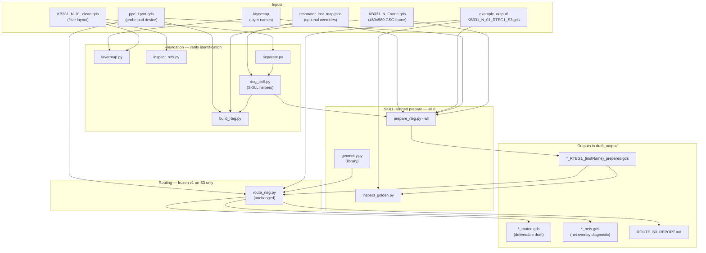

# R-tag automation workflow

This document explains **how the Python pipeline works end-to-end**: what each step does, what files it reads and writes, and how those pieces connect. For script-by-script reference tables, see [`README.md`](README.md). For project scope and engineering constraints, see [`../CLAUDE.md`](../CLAUDE.md).

---

## What you are building

An **R-tag (RTEG)** is a standalone test layout for **one resonator** (or a small split/cascade group) from a BAW filter. It sits inside a **GSG probe-pad frame** so NPI can measure that resonator in isolation and compare it to the modeled filter.

The manual flow today is done in **Cadence Virtuoso** (`rdsBawTEGAutoFromTemp.il`). This Python project reproduces that flow outside Virtuoso:

1. Start from a clean filter GDS.
2. Pick which resonator(s) need R-tags.
3. Place the resonator in the frame, carrying along the filter’s interconnect metal near it.
4. Route signal and ground, place vias, recut the ground plane.
5. Emit DRC-clean GDS.

**Current status:** pre-routing preparation is **SKILL-aligned** for all 8 resonators (`prepare_rteg.py --all`). Routing remains a frozen v1 proof-of-concept on golden S3 only (`route_rteg.py` unchanged).

---

## Big picture



---

## Concepts you need

| Term | Meaning |
|---|---|
| **Resonator** | One active BAW element (`seriesq3_*`, `shuntq3_*`, etc.). The filter has many; each can get its own R-tag. |
| **Frame** | Probe-pad template around the resonator. `KB331_N_Frame` is the full 460×580 µm GSG frame used for routing (six `BAW_MB2` bond pads). |
| **Centering** | Resonator world bbox center is aligned to the frame bbox center. Preserved metal and vias use the same `(dx, dy)` shift. |
| **Preserved metal** | Filter interconnect polygons overlapping the resonator bbox. SKILL copies from `{filter}_connect_backup`; Python tries that first, then falls back to `connectMTE` + `connectMBE` until a full backup export is available. |
| **Golden** | A known-good reference layout in `example_output/` — read-only. Used to compare metrics, not overwritten. |
| **Layermap** | Maps Skyworks names (`BAW_MBE`, `BAW_MTE`, …) to GDS `(layer, datatype)` pairs. All scripts use it; no hardcoded layer numbers. |
| **ppd_1port** | Canonical single-port probe device from the SKILL flow. Included as a **reference** in prepared output (template fidelity). `route_rteg.py` also uses it for signal-pad orientation lookup. |
| **instName** | Virtuoso instance name (e.g. `S3`, `P1`). GDS exports usually lack these; Python infers names from sorted placement and applies overrides in `resonator_inst_map.json`. |

---

## Phase 1 — Foundation (verify the GDS is readable)

Run from `python_code/`:

```powershell
pip install gdstk
python layermap.py
python inspect_refs.py
python separate.py
python build_rteg.py
```

### 1. `layermap.py`

Loads `layermap` so every later step can say `BAW_MBE` instead of `(2, 0)`.

### 2. `inspect_refs.py`

Lists every reference in the filter GDS: resonators, vias, connect cells, rotations. Use this when counts look wrong or you need to understand hierarchy.

### 3. `separate.py`

**Core identification step.** Scans the filter and finds:

- **Resonators** — masters whose names start with `series`, `shunt`, `rcap`, or `mimcap`.
- **Groups** — split/cascade families (when instance names survive export).
- **Vias** — `vtb*` cells.

Output is printed to the terminal (8 resonators for `KB331_N_01`). Order follows parent-cell reference iteration (matches SKILL `cplist`).

### 4. `rteg_skill.py`

Shared SKILL-aligned helpers (not run directly):

- `build_foundation` — die frame at top-left, ppd centered in frame, returns assembly bbox/center
- `placement_shift` — resonator bbox center → assembly center (same shift for metal/vias)
- `FRAME_ORIGIN` — die frame anchor `(0, 0)`; ppd origin is computed by `build_foundation`
- `infer_inst_names` — best-effort `S1`/`P1`/… naming + JSON overrides
- `load_connect_backup` — preserved-metal source with MTE/MBE fallback
- Overlap and polygon-shift utilities

### 5. `build_rteg.py`

**Visual sanity check only.** Exports one GDS per resonator with die frame at top-left, ppd centered in frame, and resonator centered on the assembly. Open in KLayout to confirm separation picked the right geometry. No preserved metal or vias.

---

## Phase 2 — SKILL-aligned prepare (all 8 resonators)

This is the main pre-routing workflow today:

```powershell
python prepare_rteg.py --all
python inspect_golden.py
```

Optional single resonator (golden anchor S3 is index 6):

```powershell
python prepare_rteg.py --index 6
python inspect_golden.py --prepared draft_output/KB331_N_01_RTEG1_S3_prepared.gds
```

### Step A — `prepare_rteg.py` (template assembly)

**Input:** filter GDS + `KB331_N_Frame` + `ppd_1port` + golden S3 (layer allow-list) + optional `resonator_inst_map.json`.

**What it builds (mirrors `rdsBawTEGAutoUpdateTemp`):**

1. Top cell `{parent}_RTEG1_{instName}` with **die frame** at top-left and **ppd_1port** centered in the frame.
2. Resonator shifted so **bbox center** lands on the **assembly center**; preserved metal and vias use the same shift.
3. **Preserved metal** from `{parent}_connect_backup` if available; otherwise overlapping **connectMTE / connectMBE** polygons (same shift).
4. Nearby **vtb** vias (bbox + 10 µm overlap test), shifted to match.
5. **Trims** every cell to layers present in the golden — drops die-context fill (`BAW_BF*`, `BAW_TSV`, `EM_VPT`) and resonator extras.

**Outputs:** eight files such as `draft_output/KB331_N_01_RTEG1_S3_prepared.gds` (golden anchor uses override in `resonator_inst_map.json`).

**CLI flags:**

| Flag | Purpose |
|---|---|
| `--all` | Prepare every resonator in the filter variant |
| `--index N` | Prepare one resonator (default 6 if neither flag given) |
| `--golden PATH` | Golden GDS for layer allow-list |

### Step B — `inspect_golden.py` (read-only comparison)

Compares **prepared** vs **golden S3**: layer inventory, MBE/MTE extents, missing layers grouped by family. Prints a NOTES block to the terminal.

Use `--prepared` to point at any prepared file. Default: `KB331_N_01_RTEG1_S3_prepared.gds`.

---

## Phase 3 — Routing (frozen v1, S3 only)

`route_rteg.py` is **unchanged** in this pass. It still defaults to the old `06_series` prepared/routed filenames. When routing work resumes, pass the new prepared path explicitly:

```powershell
python route_rteg.py --prepared draft_output/KB331_N_01_RTEG1_S3_prepared.gds
```

(Current defaults may still reference `*_06_series_*` until routing is updated.)

**What v1 routing does:**

| Stage | Behavior |
|---|---|
| **Signal pad** | Loads `ppd_1port`, maps it onto the nearest `pad3_*` ref in the frame. |
| **Routable region** | Frame interior minus grown resonator, release holes, and other-net metal. |
| **Signal route** | Straight, single 45°, or one L-bend connector. |
| **Ground recut** | Carves frame `BAW_MBE` fill around signal net and resonator. |
| **Net-aware DRC** | Spacing check between signal and ground nets. |
| **Net overlay** | Writes `_nets.gds` + `_nets.lyp` every run. |

**Outputs:** `*_routed.gds`, `*_nets.gds`, `ROUTE_S3_REPORT.md`.

---

## How `geometry.py` fits in

Not run directly. Shared math used by `prepare_rteg.py` and `route_rteg.py`:

- Flatten cells to world-space polygons
- Boolean grow / subtract / union / intersect
- Build routable region and simple connectors
- `build_nets()` — same net builder used by DRC and the `_nets.gds` overlay
- Golden layer allow-list and overlap metrics

---

## Data flow (SKILL-aligned prepare)

```
KB331_N_01_clean.gds
        │
        ├─ separate.py ──────────────► 8 resonators (stable ref order)
        │
        ├─ rteg_skill.py ────────────► inst names, centering, connect_backup
        │
        └─ prepare_rteg.py --all
               │
               ├─ KB331_N_Frame.gds ───► GSG frame + bond pads
               ├─ ppd_1port.gds ───────► template ref at origin
               ├─ resonator ───────────► centered in frame (same shift for metal/vias)
               ├─ connect_backup ──────► preserved metal (or MTE/MBE fallback)
               ├─ vtb vias ────────────► bbox+10 µm prune, same shift
               ├─ golden layer trim ───► drop BF/TSV/EM_VPT etc.
               │
               ▼
        *_RTEG1_{instName}_prepared.gds  (×8)
               │
               └─ inspect_golden.py ───► terminal NOTES (no file)
```

---

## Folders

| Folder | Purpose |
|---|---|
| `python_code/` | Scripts, inputs (`*.gds`, `layermap`), this workflow doc |
| `example_output/` | **Ground truth** — never written by Python |
| `draft_output/` | **Generated drafts** — prepared, routed, nets overlay, report |

---

## What is not done yet

- **Routing for all 8** — only frozen S3 v1 in `route_rteg.py`
- **Full `connect_backup`** — need `{filter}_connect_backup.gds` export from Virtuoso (~100+ polys)
- **Exact `_RTEG1_template`** — ppd placement may differ until Virtuoso template export
- **Inferred inst names** — sort-order guess; override via `resonator_inst_map.json` (index 6 → `S3` for golden anchor)
- Frame MF/TF trim props, ppd labels, splits, Infra35, fill/`BAW_H*` layers

The report (`ROUTE_S3_REPORT.md`) lists routing assumptions and divergences explicitly.

---

## Quick reference — commands

```powershell
cd python_code

# Verify identification
python separate.py
python build_rteg.py

# SKILL-aligned prepare (all 8)
python prepare_rteg.py --all

# Compare prepared S3 to golden
python inspect_golden.py
python inspect_golden.py --prepared draft_output/KB331_N_01_RTEG1_S3_prepared.gds

# Routing (frozen v1 — pass new prepared path when resuming)
python route_rteg.py --prepared draft_output/KB331_N_01_RTEG1_S3_prepared.gds

# Open in KLayout
#   draft_output/KB331_N_01_RTEG1_S3_prepared.gds   ← SKILL-aligned prepare output
#   draft_output/KB331_N_01_RTEG1_06_series_routed.gds  ← old v1 routed (if present)
```

---

## Reading the report

After `route_rteg.py`, open `draft_output/ROUTE_S3_REPORT.md`. The sections that matter most:

1. **Signal route** — did the connector draw or skip?
2. **Primary metric** — MBE/MTE overlap % vs golden
3. **Layer trim** — any layers still absent from golden after trim?
4. **DRC** — introduced cross-net violations (target: 0)
5. **Net overlay (§4b)** — SIGNAL / GROUND / OTHER classification
6. **Missing-layer inventory** — what the golden has that v1 does not generate

After `prepare_rteg.py --all`, check the terminal for connect_backup fallback warnings and per-resonator `rteg@` placement (resonator -> assembly center).
